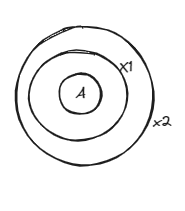
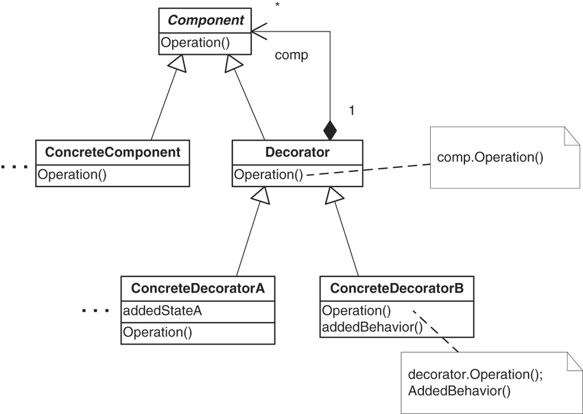

#### Definition: 
##### Decorator pattern attaches ***additional responsibilities*** to an object ***dynamically***.  Provides a flexible alternatives to subclassing.

- A decorator is both ***is a*** and ***has a***
- uses composition to share behaviour (has a) , but acts as a (is a).

#### The problem: 
- Lets say we have a base beverage class with two children A and B.
- Now there are many AddOns these beverages can have, lets name then X1 and X2.
- The end goal is make sure the client can get any combination of beverages with addons like AX1, AX1X2 , BX2 and so on.

#### Ways to go about :

##### Initial intuition : 
- maybe we can have every combination as a child class of beverage. (class exploitation)

##### Slight refining: 
- instead of having every combination, have every unique thing as childclass and have booleans to keep track of what is needed in end beverage. 

##### Decorator pattern : 
- very similar to recursion. wrap up the base beverage with multiple addons.

- so for AX1X2 , it will look like 

###### UML DIAGRAM:

##### Better alternative : get the list of addons in base component itself? 

why? 

#### DECORATOR PATTERN IS MORE USEFUL WHEN THERE IS BEHAVIOR CHANGES WITH NEW DECORATORS INTRODUCED.
