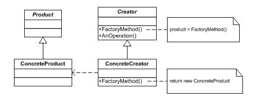
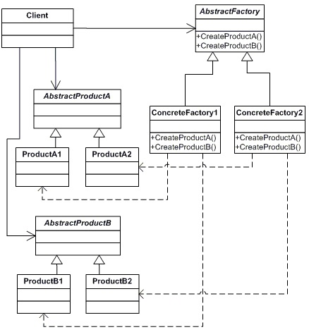

#### GOAL :
 - When there are som calculations needed for a object creation and these steps are repeated in multiple places. we can wrap them up in a class (factory) and have a method to create those objects.

 - We can also have multiple factories , and change them up dynamically .

 #### UML DIAGRAM

 

- There can be some variations where we need factory to give multiple instances (abstract factory)

