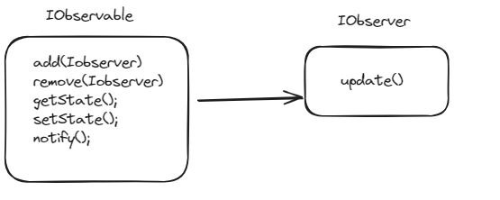

### GOAL :
##### Moving from poll architecture to push architecture.
***
### USECASE : 
##### Consider a usecase, where we have a weather station which has constant updates. Now we have say a system A, which needs the station's current state. Typically the first thought is make system A, poll for changes from station periodically (say every second).

##### This is a bad idea. Now if another system comes, it needs to poll again. ***So instead of polling for current state, why not tell the station to push a notification to the system that its been updated, whenever a update happens***. 

***

- things that undego changes are ***observables***
- things that need these changes of observables are ***observers***

***

***
##### There can be multiple variations of interactions betweem observble and observers.

- The observable can push(notify) info that the state has been changed and observable can push(send) info about the new state.

- The observable can push(notify) info that the state has been changed and observer can pull(get) info about the new state. (Here the observer needs the implementation of observable though)

***

#### Current Implementation : push push.
- An observer must use the observable's add method to register itself and remove to unregister itself;
-Whenever the state of the observable changes, the update method of observers is called with the new state of the observable.