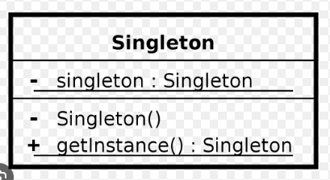

##### GOAL : 
- have only a single instance of object . (very bad pattern, do not make a situation where you need to use this pattern);

##### HOW :
- use static methods, and have private constructor.

##### UML :

