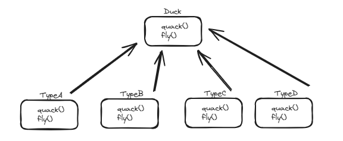
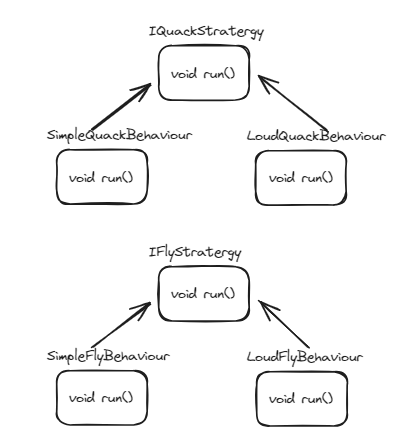
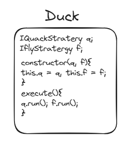

## GOAL : 
##### *reduce code repeatition*. when common behaviours of same type are shared between multiple classes, inhertance is not the ideal way to go to, if the relationship is not heirarchical.

***
#### Consider a use case, where we need four different types of duck. 
- typeA has simple quacking and simple flying.
- typeB has simple quacking and fast flying.
- typeC has loud quacking and simple flying.
- typeD has loud quacking and fast flying.

##### Normally, we create maybe say a base class , Duck with functions for quack and fly. Then four subclasses, each overriding both the methods for their respective quacking and flying.

##### it is stated that type A and B have the same quacking and, C and D have the same quacking. Likewise A and C has same flying whereas B and D has same flying.

***We can see sibling classes have same behaviours and is being repeatedly implemented***

## SOLUTION :

##### Create Independent stratergies for each type and have each of them implemented by different behaviours. Then inject these behaviours into client side but as reference to Stratergy itself. So *in future, we can add/ remove behaviours*

##### ***So finally it is injected as dependencies as***

